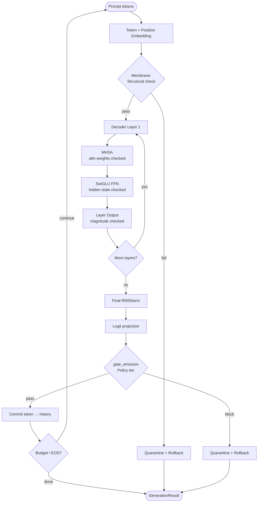
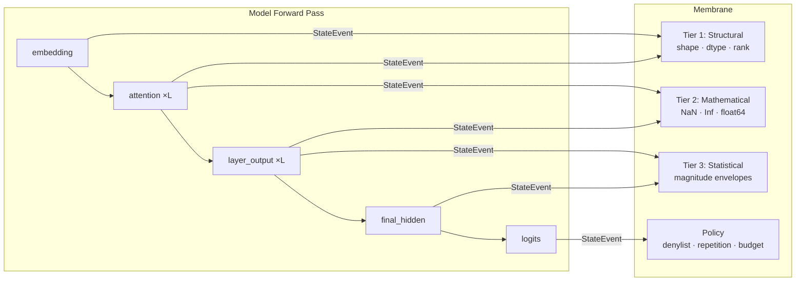
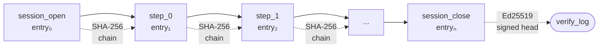
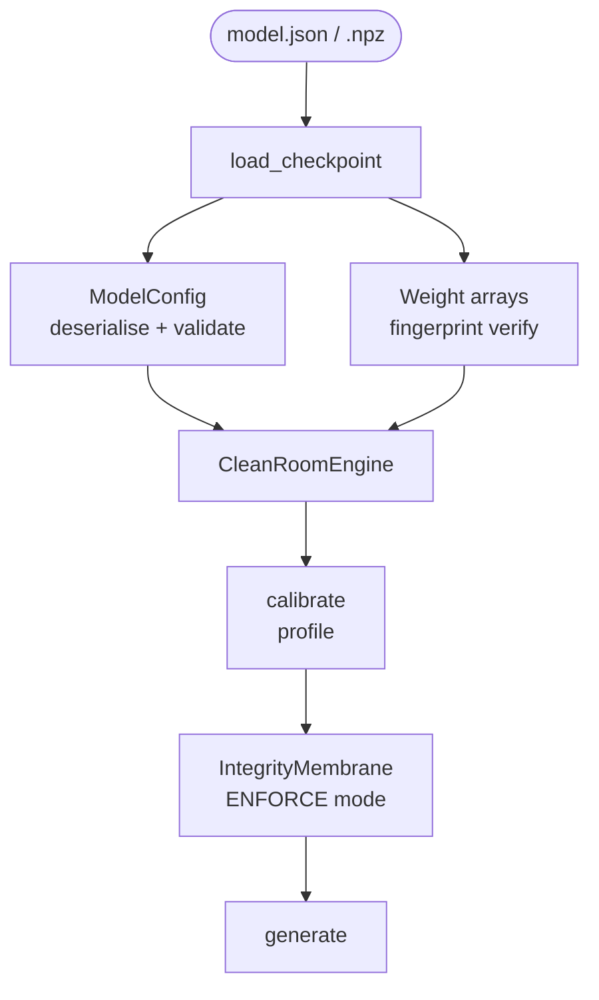

# clean-room-transformer


A decoder-only transformer where every layer boundary is intercepted by an **integrity membrane** — a runtime invariant enforcer that checks structural, mathematical, and statistical contracts, quarantines violations, rolls back KV cache state, and writes to a hash-chained, Ed25519-signed append-only log.

Two dependencies only: `numpy` and `cryptography`, both hash-pinned.

---

## Architecture

### Execution Flow



### Membrane Intercept Pipeline



### Audit Chain



### Checkpoint Load & Configure



---

## Quick Start

```bash
pip install -r requirements.txt
pytest                        # 154 tests
python scripts/demo.py        # clean run + injected fault demo
python scripts/benchmark.py   # throughput, latency, membrane overhead
python scripts/load_checkpoint.py --checkpoint model.json --prompt "Hello"
python scripts/verification_report.py
```

Docker (air-gapped):
```bash
docker build -t clean-room-transformer docker/
docker run --network none clean-room-transformer
```

---

## Measured Results

| Metric | Result |
|--------|--------|
| Fault detection | **14 / 14** (fixed corpus) |
| False positives | **0 / 330** clean inspections |
| Audit entries verified | **146** |
| Single-byte edit detected | ✓ |
| Benchmark throughput | see `scripts/benchmark.py` output |

---

## Spec → Code

| Spec item | File |
|-----------|------|
| Isolation | `src/membrane/interceptor.py` |
| Deterministic init | `src/transformer/model.py` |
| KV cache alloc + rollback | `src/runtime/engine.py` |
| MHSA + SwiGLU | `src/transformer/layers.py` |
| State serialisation | `src/transformer/model.py` |
| Invariant enforcement | `src/membrane/invariants.py` |
| Sovereign audit chain | `src/membrane/audit.py` |
| Policy tier | `src/membrane/policy.py` |
| Calibration | `src/membrane/calibration.py` |
| Verification suite | `tests/` |
| Benchmark | `scripts/benchmark.py` |
| Checkpoint load | `scripts/load_checkpoint.py` |

---

## Invariant Tiers

| Tier | Kind | Tolerance |
|------|------|-----------|
| Structural | exact shape · dtype · rank | none |
| Mathematical | NaN · Inf · float64 promotion | none |
| Statistical | calibrated magnitude envelopes | heuristic (margin × calibrated bound) |

---

## Fault → Tier → Rule

| Fault | Tier | Rule |
|-------|------|------|
| NaN / Inf in activations | Mathematical | `no_nan`, `no_inf` |
| Truncated axes | Structural | `exact_shape` |
| float64 promotion | Mathematical | `dtype_preserved` |
| Rank collapse | Structural | `rank_preserved` |
| Magnitude explosion | Statistical | `magnitude_within_envelope` |
| Causal mask leak | Mathematical | `causal_mask_valid` |
| Attention mass error | Mathematical | `attention_mass_unit` |
| Denylist token | Policy | `denylist` |
| Repetition | Policy | `repetition_budget` |
| Token budget | Policy | `budget` |

---

## Model Configuration

Default (`src/transformer/config.py`):

```python
ModelConfig(
    vocab_size  = 256,   # byte-level, no external tokenizer
    d_model     = 64,
    n_heads     = 4,
    n_layers    = 4,
    d_ff        = 176,   # SwiGLU inner ~= 8/3 × d_model
    max_seq_len = 64,
    norm_eps    = 1e-5,
    seed        = 20260918,
)
```

The `schema_hash()` (SHA-256 of canonical JSON) is recorded in every audit entry.

---

## Directory

```
clean-room-transformer/
├── src/
│   ├── transformer/        config, model, layers, hooks, determinism, shapes
│   ├── membrane/           interceptor, invariants, policy, audit, calibration
│   ├── runtime/            engine
│   ├── metal-transformer/  MetalTransformer.swift + Transformer.metal (GPU)
│   └── haskell-transforms/ CoreToLogic.hs + DenseDex.hs (Liquid Haskell)
├── tests/                  154 tests — determinism, invariants, audit, rollback, e2e
├── scripts/
│   ├── demo.py             clean + fault injection walkthrough
│   ├── benchmark.py        throughput / latency / membrane overhead
│   ├── load_checkpoint.py  checkpoint deserialise + generate
│   ├── mutation_probe.py
│   ├── verification_report.py
│   └── run_verification_suite.sh
└── docker/Dockerfile
```

---

## Honest Scoping

- No formal verification. "14/14" and "0/330" are over a fixed corpus, not a universal guarantee.
- No semantic content inspection. The membrane sees tensor values, not meaning.
- Scale: `d_model=64`, 4 layers, 4 heads, untrained noise weights. Production use requires recalibration.
- Mixed precision deliberately unsupported; single `float32` throughout.

---

## Milestone 1 Additions (Sep 18 2026)

Swift modules in `src/metal-transformer/` and Haskell transforms in `src/haskell-transforms/`
added from devflow-finance-twin. See `SwiftTinyLLM-milestone1.zip` for the full Swift package
(ModelConfig · Tensor · Random · ByteTokenizer · RMSNorm · SwiGLU · RoPE).
